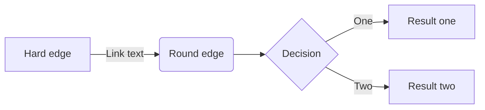

# Flowcharts

[Flowcharts](https://mermaidjs.github.io/flowchart.html) can be rendered using the [mermaid](https://mermaidjs.github.io/) library as an in-browser transformation of the markdown code block to an SVG image.

